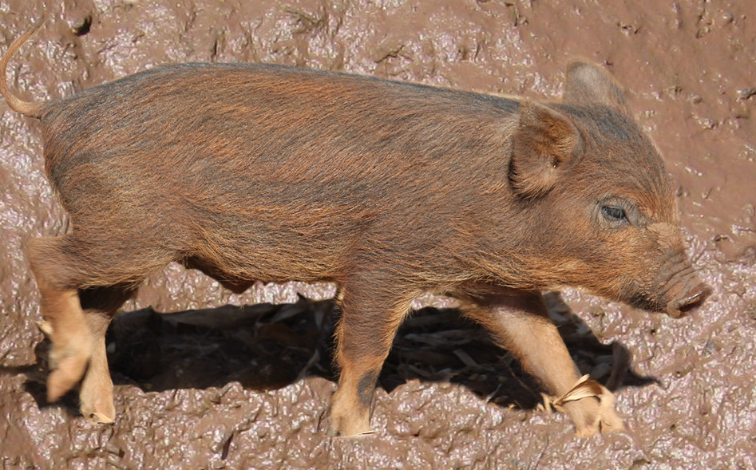

# Técnicas de Programação

Bem vindo ao material de Técnicas de Programação (2023/2). Por aqui você encontrará todo o material de apoio da disciplina, incluindo links para entrega das atividades e um [calendário do semestre](sobre.md#calendario-do-semestre).

Nossa disciplina tem um mascote: o **javaporco**. Ele foi escolhido em homenagem à qualidade do código Java desenvolvido nessa disciplina. (Créditos: [javaporco](https://flickr.com/photos/luizmrocha/4777371771), [lama](https://commons.wikimedia.org/wiki/File:Mud_closeup.jpg))

## Links importantes

* [Blackboard da disciplina](https://insper.blackboard.com/webapps/blackboard/execute/announcement?method=search&context=course&course_id=_44410_1&handle=cp_announcements&mode=cpview): usado somente para avisos e notas. 
* [Regras da disciplina](sobre.md): toda a parte de horários, aprovação e calendário da disciplina está aqui. Não deixe de ler com atenção.
* [Calendário acadêmico](https://www.insper.edu.br/portaldoprofessor/wp-content/uploads/2022/03/CALEND%C3%81RIO-ACAD%C3%8AMICO-PROFESSOR-CI%C3%8ANCIA-DA-COMPUTA%C3%87%C3%83O-S%C3%89RIE-123-e-4.pdf): Calendário de atividades do Insper.
