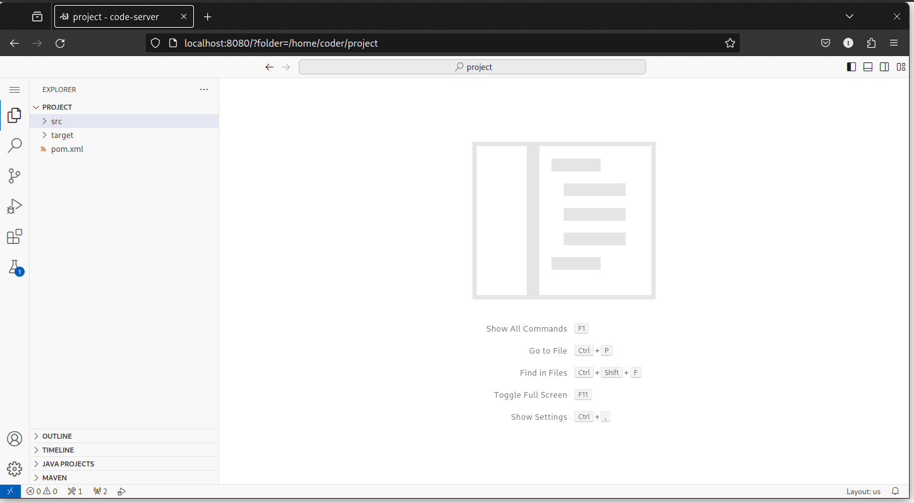

# Codando algoritmos em Java

Usaremos um tipo especial de exercício chamado **Workspace**, em que abriremos um ambiente do VSCode já configurado para programar. A princípio será um ambiente quase idêntico ao que seria instalado no PC de vocês, porém acessível via Browser e pré-configurado. 

[Entrar no PrairieLearn]({{ PL_url_course }}){ .ah-button .ah-button--primary}
<!--<ah-button primary href="{{ PL_url_course }}">Entrar no PrairieLearn</ah-button>-->

Você deve ver o *Módulo 0* já disponível e com entrega para 16/02. Ao entrar nele haverão diversos exercícios de codificação. Vamos entrar no primeiro deles: *Hello World*. Depois de ler o enunciado é só ir em *Open Worspace* para que, depois de alguns segundos, a seguinte tela seja aberta.

Esse é um VSCode rodando remotamente em uma VM na AWS. Cada exercício tem uma VM própria sem acesso à internet e com as extensões e pacotes de desenvolvimento Java já instalados e configurados. 

Na aba de projeto você deve ver um pacote `br.edu.insper.tecprog` com um arquivo `Hello.java`. Abra-o e use o botão *Run* como abaixo para executá-lo.

Finalmente, veja na aba lateral que a extensão de testes identificou que existem testes disponíveis! Execute-os e veja que há uma falha. 

!!! exercise long id_leiturajava
    Leia o erro retornado e releia o código de `Hello.java`. O que deve ser modificado para que o teste passe?

Faça a modificação e veja que agora os testes passam. O passo final é entregar o exercício feito. Para isso você deve voltar no enunciado do exercício e clicar em *Save and Grade*.

!!! warning "Atenção"
    O exercício só está pronto e corrigido se clicar no *Save and Grade*. Não adianta só fazer o exercício dentro do workspace, tem que explicitamente entregar ele.

    Outro ponto: você pode tentar diversas soluções sem se preocupar com nota. A que vale será sempre a maior nota já obtida e não a última submissão.
