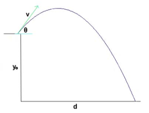

# 03 - Primeiros algoritmos

Neste roteiro iremos criar nossos primeiros algoritmos em Pseudo-Código e explorar sua "tradução" para Java. Conforme o roteiro avança haverá leituras (curtas) recomendadas sobre sintaxe e semântica de Java.

<!-- 
!!! warning "Pré-requisitos"
    Esta aula é feita em conjunto com os exercício no PrairieLearn. Você precisa ter feito as seguintes atividades antes de prosseguir:

    - [Java no PrairieLearn](java/infra.md): básico da infra usada na disciplina.
    - [Primeiro contato com Java](java/primeiro-contato.md) 

    Feitos esses dois guias, abra o *Módulo 0 - parte 1* no PrairieLearn e siga o handout. Cada problema tem um exercício de implementação em Java no PrairieLearn com testes automatizados que checam sua solução. -->


## O esqueleto de um algoritmo

Todo algoritmo é formado pelo seguinte "esqueleto":

--------

* **Entrada**:
    - lista de parâmetros do algoritmo, incluindo tipos
    - incluir também leitura de dados usando `LER_<TIPO>`.
    - Inteiro `I` (parâmetro)
    - String `S1` (parâmetro)
* **Saída**:
    - resumo da saída do algoritmo, incluindo possíveis `PRINT`
    - pode conter mais de um item se ajudar a entender saídas que são condicionais
    - devolve X caso A
    - devolve Y caso contrário

```
NOME_DO_ALGORITMO(I, S1)

# Atribuições e operações matemáticas
MAIS_UM := I + 1

# Saída de texto
PRINT(MAIS_UM)

# Entrada de dados
NOVO_INT := LER_INTEIRO()
NOVO_FLOAT := LER_FRACIONARIO()
NOVO_TEXTO := LER_TEXTO()
```


!!! warning "Atenção" 
    Usamos `:=` para atribuição e `=` para comparações.

--------

Vamos aplicar esse formato para dois problemas simples e já implementá-los em Java.


### Área do triângulo

Faça uma função que calcula a área de um triângulo de base b e altura h, ela deve receber os valores nesta ordem.

!!! exercise long id_algoritmo_pemdas_triangulo_entrada
    Qual são os dados de entrada? Escreva seus nomes e tipos na ordem que seriam recebidos. 

    !!! answer
        - `FRACIONÁRIO B`
        - `FRACIONÁRIO H`

!!! exercise long id_algoritmo_pemdas_triangulo_saida
    Qual são os dados de saída? Escreva seus nomes e tipos, indicando se são retorno de função ou `PRINT`.

    !!! answer
        A função devolve um `FRACIONÁRIO` com o valor da área do triÂngulo

!!! exercise long id_algoritmo_pemdas_triangulo_algoritmo
    Agora escreva abaixo um pseudo-código (no modelo acima) que resolva o exercício acima. Chame seu algoritmo de `AREA_TRIANGULO`.

    !!! answer
        ```
        AREA_TRIANGULO(B, H)

        DEVOLVE B * H / 2
        ```

!!! exercise self id_algoritmo_pemdas_triangulo_java
    Vamos agora implementar esse algoritmo em Java. Abra o exercício *Área do Triângulo* no PrairieLearn e converta o algoritmo desenvolvido acima para Java. A função já está pronta, é só ir e completar.

    **Dicas**: 

    - `DEVOLVE` em Java é feito usando `#!java return`.
    - após cada linha você deve colocar um `;`. Isso significa que a instrução atual acabou e a próxima deve ser lida

### Lançamento de Projétil

Faça uma função que calcule a distância alcançada por um projétil lançado com velocidade $v$ em um ângulo $\theta$, de uma altura $y_0$. A distância é dada pela fórmula. Use $g=9.8$.

$$d = \frac{v^2}{2g} \left(1 + \sqrt{1 + \frac{2g y_0 }{ v^2 (\sin(\theta) )^2 }} \right) sin(2\theta)$$




!!! exercise long id_algoritmo_pemdas_lancamento_entrada
    Qual são os dados de entrada? Escreva seus nomes e tipos na ordem que seriam recebidos. 

    !!! answer
        - `FRACIONÁRIO V` - velocidade em m/s
        - `FRACIONÁRIO THETA` - ângulo do lançamento
        - `FRACIONARIO Y0` - altura do lançamento

!!! exercise long id_algoritmo_pemdas_lancamento_saida
    Qual são os dados de saída? Escreva seus nomes e tipos, indicando se são retorno de função ou `PRINT`.

    !!! answer
        A função devolve um `FRACIONÁRIO` com a distância do projétil até tocar o chão

!!! exercise long id_algoritmo_pemdas_lancamento_algoritmo
    Agora escreva abaixo um pseudo-código (no modelo acima) que resolva o exercício acima. Chame seu algoritmo de `DISTANCIA_LANCAMENTO`. Você pode supor que as funções `RAIZ` e `SENO` existem e fazem o correspondente com suas definições matemáticas.

    !!! answer
        Para facilitar a escrita do algoritmo o dividi em três partes, conforme se está antes, dentro ou depois dos parênteses. 

        ```
        DISTANCIA_LANCAMENTO(V, THETA, Y0)

        G := 9.8

        PARTE1 := (V * V) / (2 * G)

        SENO_THETA := SENO(THETA)
        PARTE2_1 := (2 * G * Y0) / (V * V * SENO_THETA * SENO_THETA)
        PARTE2_2 := 1 + RAIZ(1 + PARTE2_1)
        
        PARTE3 := SENO(2 * THETA)
        
        DEVOLVE PARTE1 * PARTE2_2 * PARTE_3
        ```

Reparou que no algoritmo acima usei `V * V`? Isso é feito pois os operadores Python `//` e `**` são específicos dessa linguagem e queremos descrever nossa solução de maneira independente de linguagem. Assim, vamos levar em conta os seguintes pontos ao escrever algoritmos:

1. podemos usar a fórmula matemática mesmo ($V^2$)
2. podemos ser explícitos e escrever tudo com detalhes
3. no caso da divisão inteira, dividir dois tipos inteiro sempre causa uma divisão inteira. 

!!! exercise self id_algoritmo_pemdas_lancamento_java
    Vamos agora implementar esse algoritmo em Java. Preencha o esqueleto na classe `br.edu.insper.tecprog.aps0.Lancamento`, implemente o algoritmo acima e rode os testes.

    **Dicas**: 

    - O pacote [Math](https://docs.oracle.com/en/java/javase/17/docs/api/java.base/java/lang/Math.html) possui funções para raiz quadrada e seno. Consulte a documentação e as use na sua implementação. 


## Condicionais

Expressamos a ideia de condicional em Pseudo código como abaixo. A tradução Java está na aba seguinte. 

!!! warning
    Quando descrevemos ideias condicionais em Português normalmente usamos frases com o seguinte

    - Faça XXX SE YY for verdade

    Em Pseudo-código (e programação em geral) essa estrutura é invertida:

    - SE YY for verdade ENTÃO faça XXX

=== "Pseudo Código"
    ```
    SE <CONDIÇÃO AQUI> ENTÃO
        FAZ ALGO AQUI
    SENÃO
        FAZ OUTRA COISA
    FIM
    ```

=== "Java"
    ```java
    if (condicao) {
        // faz algo aqui
    } else {
        // faz outra coisa aqui
    }
    ```

!!! warning
    - Não se esqueça que em java os valores booleanos são `#!java true` e `#!java false` (com letras minúsculas).
    - Em pseudo código usamos `=` para comparar, já que a atribuição usa :=
    - Em Java usamos `==` para comparar `int`, `double` e `boolean`
    - Se o tipo não for um dos acima, usamos o método `equals()`

### FizzBuzz

Faça uma função que recebe como entrada um número inteiro e testa a divisibilidade por 2 e 3. Se for divisível por 2, sua função deve retornar a string `"Ins"`. Se for por 3, retorna `"per"`. Porém, se for por 2 e 3 ao mesmo tempo retorna `"Insper"`. Para outros casos, sua função deve devolver a string vazia.

!!! exercise long id_algoritmo_if_fizzbuzz_entrada
    Qual são os dados de entrada? Escreva seus nomes e tipos na ordem que seriam recebidos. 

    !!! answer
        - `INTEIRO N`

!!! exercise long id_algoritmo_if_fizzbuzz_saida
    Qual são os dados de saída? Escreva seus nomes e tipos, indicando se são retorno de função ou `PRINT`.

    !!! answer
        A função devolve um `STRING` que depende da divisibilidade de `N` por 2 e 3

!!! exercise long id_algoritmo_if_fizzbuzz_algoritmo
    Agora escreva abaixo um pseudo-código (no modelo acima) que resolva o exercício acima. Chame seu algoritmo de `DIVISIBILIDADE`.

    **Importante**: existem várias soluções corretas. A apresentada na resposta é somente uma delas. 

    !!! answer
        ```
        DIVISIBILIDADE(N)

        SE N é divisível por 2 E N não é divisível por 3 ENTÃO
            DEVOLVE "Ins"
        FIM
        
        SE N não é divisível por 2 E N é divisível por 3 ENTÃO
            DEVOLVE "per"
        FIM

        SE N é divisível por 2 E N é divisível por 3 ENTÃO
            DEVOLVE "Insper"
        FIM
        
        DEVOLVE ""
        ```

!!! exercise self id_algoritmo_if_fizzbuzz_java
    Vamos agora implementar esse algoritmo em Java. Preencha o esqueleto na classe `br.edu.insper.tecprog.aps0.Divisibilidade`, implemente o algoritmo acima e rode os testes.

    **Dicas**:
    - Em Java, usamos `&&` para `E` e `||` para `OU` em condições


### Jaca Wars

Você mora no sítio, e está em guerra com seu vizinho. Você dispõe de uma catapulta de lançamento de jacas, onde você consegue escolher a velocidade v e o ângulo $\theta$, **em graus**, de lançamento da jaca. Uma jaca quando cai se espalha por um raio de 2 metros. Seu alvo é a catapulta do vizinho, que está à 100 metros da sua.

Faça um programa que pede a velocidade e o ângulo de lançamento da sua jaca, e diz se ela cairá muito perto, muito longe, ou acertará o alvo. Considere que a jaca acerta o alvo se cai à uma distância do alvo menor que o seu raio de espalhamento. A fórmula da distância alcançada por um projétil (na ausência de efeitos de arrasto da atmosfera) é:

$$ d = \frac{v^2\sin(2\theta)}{g} $$

onde $g=9.8 m/s^2$. Os possíveis valores de retorno são `'Muito perto'`, `'Muito longe'` e `'Acertou!'`. Considere "Muito perto" se não chegou no alvo, e "Muito longe" se passou do alvo. O seu programa deve devolver exatamente essas strings, caso contrário ele será considerado errado (mesmo que a fórmula esteja correta).

!!! exercise long id_algoritmo_if_jaca_entrada
    Qual são os dados de entrada? Escreva seus nomes e tipos na ordem que seriam recebidos. 

    !!! answer
        - `FRACIONÁRIO V` - velocidade de lançamento
        - `FRACIONÁRIO THETA` - ângulo de lançamento

!!! exercise long id_algoritmo_if_jaca_saida
    Qual são os dados de saída? Escreva seus nomes e tipos, indicando se são retorno de função ou `PRINT`.

    !!! answer
        O programa devolve:

        - "Muito perto" se a java não chegou no alvo
        - "Muito longe" se ela ultrapassou o algo
        - "Acertou" se ela acertou o alvo

!!! exercise long id_algoritmo_if_jaca_algoritmo
    Agora escreva abaixo um pseudo-código (no modelo acima) que resolva o exercício acima. Chame seu algoritmo de `ACERTOU_JACA`.

    **Importante**: existem várias soluções corretas. A apresentada na resposta é somente uma delas. 

    !!! answer
        ```
        ACERTOU_JACA(V, THETA)

        G := 9.8
        DISTANCIA := (V*V * SENO(2*THETA)) / G

        SE DISTANCIA < 98 ENTÃO
            DEVOLVA "Muito perto"
        FIM

        SE DISTANCIA > 102 ENTÃO
            DEVOLVA "Muito longe"
        FIM
        
        DEVOLVA "Acertou!"        
        ```

!!! exercise self id_algoritmo_if_jaca_java
    Vamos agora implementar esse algoritmo em Java. Preencha o esqueleto na classe `br.edu.insper.tecprog.aps0.JacaWars`, implemente o algoritmo acima e rode os testes.

## Loops (I)

Loops `ENQUANTO` representam a ideia de repetição até que uma condição seja verdadeira. Tipicamente usamos esse loop quando não temos certeza do número de vezes que o loop executará. Veja abaixo as sintaxes para pseudo-código e Java.

=== "Pseudo Código"
    ```
    ENQUANTO <CONDIÇÃO> FAÇA
        FAZ ALGO REPETIDAMENTE AQUI
    FIM
    ```

=== "Java"
    ```java
    while (condicao) {
        // faz algo repetidamente aqui
    } 
    ```

Vamos agora direto para exercícios que usem essa construção. 

### Quantos uns

Escreva uma função que recebe um número e devolve a quantidade de vezes que o algarismo 1 ocorre nesse número.


!!! exercise long id_algoritmo_while_uns_entrada
    Qual são os dados de entrada? Escreva seus nomes e tipos na ordem que seriam recebidos. 

    !!! answer
        - `INTEIRO N`

!!! exercise long id_algoritmo_while_uns_saida
    Qual são os dados de saída? Escreva seus nomes e tipos, indicando se são retorno de função ou `PRINT`.

    !!! answer
        O programa devolve um `INTEIRO` com o número de vezes que o algarismo 1 aparece no número.

!!! exercise long id_algoritmo_while_uns_algoritmo
    Agora escreva abaixo um pseudo-código (no modelo acima) que resolva o exercício acima. Chame seu algoritmo de `QUANTOS_UNS`.

    !!! answer
        ```
        QUANTOS UNS(N)
            CONTADOR := 0

            ENQUANTO N > 0 FAÇA
                DIGITO = N % 10 # resto da divisão de N por 10 
                SE DIGITO = 1 ENTÃO
                    CONTADOR := CONTADOR + 1
                FIM
                N = N / 10
            FIM

            DEVOLVE CONTADOR
        ```

!!! exercise self id_algoritmo_while_uns_java
    Vamos agora implementar esse algoritmo em Java. Preencha o esqueleto na classe `br.edu.insper.tecprog.aps0.QuantosUns`, implemente o algoritmo acima e rode os testes.


## Loops (II)

Loops `PARA CADA` representam a ideia de repetição em um conjunto conhecido de valores. Tipicamente usamos esse loop para contagens ou para percorrer os elementos de uma coleção de valores. Veja abaixo as sintaxes para pseudo-código e Java.

=== "Pseudo Código"
    ```
    PARA CADA I=0 ATÉ 10 FAÇA
        # FAZ ALGO COM I
    FIM
    ```

=== "Java"
    ```java
    for (int i = 0; i < 10; i++) {
        // faz algo com i
    } 
    ```

Vamos agora direto para exercícios que usem essa construção. 


### Estimando o valor de pi

O valor de $\pi$ pode ser aproximado a partir da seguinte fórmula: 

$$\pi = \sqrt{\frac{6}{1^2} + \frac{6}{2^2} + \frac{6}{3^2} + \dots + \frac{6}{n^2}}$$

Faça uma função que recebe o valor de $n$ e retorna o resultado da fórmula acima utilizando os $n$ termos.


!!! exercise long id_algoritmo_for_pi1_entrada
    Qual são os dados de entrada? Escreva seus nomes e tipos na ordem que seriam recebidos. 

    !!! answer
        - `INTEIRO N`

!!! exercise long id_algoritmo_for_pi1_saida
    Qual são os dados de saída? Escreva seus nomes e tipos, indicando se são retorno de função ou `PRINT`.

    !!! answer
        O programa devolve um `FRACIONÁRIO` com o valor estimado de $\pi$.

!!! exercise long id_algoritmo_for_pi1_algoritmo
    Agora escreva abaixo um pseudo-código (no modelo acima) que resolva o exercício acima. Chame seu algoritmo de `CALCULA_PI`.

    !!! answer
        ```
        CALCULA_PI(N)
            PI_2 := 0

            PARA CADA I:=1 ATÉ N+1 FAÇA
                PI_2 := PI_2 + 6 / (I * I)
            FIM 
            
            DEVOLVE RAIZ(PI_2)
        ```

!!! exercise self id_algoritmo_for_pi1_java
    Vamos agora implementar esse algoritmo em Java. Preencha o esqueleto na classe `br.edu.insper.tecprog.aps0.CalculaPI`, implemente o algoritmo acima e rode os testes.


### Fatorial

Escreva uma função que recebe um número $n$ e devolve o valor de $n! = 1\cdot 2\cdot 3\cdot\dots\cdot n$.

!!! exercise long id_algoritmo_for_fatorial_entrada
    Qual são os dados de entrada? Escreva seus nomes e tipos na ordem que seriam recebidos. 

    !!! answer
        - `INTEIRO N`

!!! exercise long id_algoritmo_for_fatorial_saida
    Qual são os dados de saída? Escreva seus nomes e tipos, indicando se são retorno de função ou `PRINT`.

    !!! answer
        O programa devolve um `INTEIRO` com o fatorial de `N`

!!! exercise long id_algoritmo_for_fatorial_algoritmo
    Agora escreva abaixo um pseudo-código (no modelo acima) que resolva o exercício acima. Chame seu algoritmo de `FATORIAL`.

    !!! answer
        ```
        FATORIAL(N)
            FAT := 1

            PARA CADA I=1 ATÉ N+1 FAÇA
                FAT := FAT * I
            FIM

            DEVOLVE FAT
        ```

!!! exercise self id_algoritmo_for_fatorial_java
    Vamos agora implementar esse algoritmo em Java. Preencha o esqueleto na classe `br.edu.insper.tecprog.aps0.Fatorial`, implemente o algoritmo acima e rode os testes.

