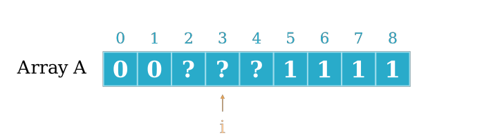

<style>
img[alt~="center"] {
  display: block;
  margin: 0 auto;
}
</style>

# Técnicas de Programação

## Busca em vetores

------

# Algoritmo: sequência de passos (finita) para resolver um problema

1. escritos em pseudo-código 
2. focam na resolução do problema e não em detalhes de implementação

------------

# Perguntas importantes

1. Como representar um algoritmo sem código?
2. Quantas operações esse algoritmo realiza?
3. Dado um algoritmo incorreto, como mostrar que ele está errado?

---------

# Algoritmos de busca

- busca sequencial
- busca binária


---------

# Em termos de número de operações, esses algoritmos são equivalentes?

## Vamos sempre contar o número de operações **no pior caso**

---------

# Definições

Dado um array de tamanho $n$, seja $f(n)$ o número de operações feitas pela busca sequencial e $g(n)$ o número de operações feitas pela busca binária. 

1. $f(n) > 0, g(n) > 0 \forall n > 0$
2. estamos interessados somente no caso em que $n$ é grande
    - se $n$ é pequeno então vai ser rápido....
    - pequeno/grande depende de cada problema


### **Pergunta**: Conforme $n$ aumenta, $f(n)$ (1) cresce mais rápido, (2) de maneira equivalente ou (3) mais lentamente que $g(n)$?

--------------------

# Definições II

Vamos usar limites pra isso!

$$
\lim_{n\rightarrow+\infty} \frac{f(n)}{g(n)}
$$

Qual o valor desse limite se $f(n)$ for ____ que $g(n)$?

1. mais rápido?
2. equivalente?
3. mais lento?

------------------

# Definições III

1. **mais rápido**:

$$
\lim_{n\rightarrow+\infty} \frac{f(n)}{g(n)} = +\infty
$$
2. **equivalente**

$$
0 < \lim_{n\rightarrow+\infty} \frac{f(n)}{g(n)} < +\infty
$$

3. **mais lento**:

$$
\lim_{n\rightarrow+\infty} \frac{f(n)}{g(n)} = 0
$$

---------------

# Exercício 

1. escrever juntos os algoritmos "oficiais" das buscas sequenciais e binária
2. **Parte 1** do handout de hoje. (10-15 minutos)
3. Discussão na lousa

-------

No commit mais novo tem bug

```
67957b0f23425 (HEAD \rightarrow modulo2, origin/main, origin/HEAD, main) pequenas modificações
6fd3c935d611e Atualização javaporco
b3892f2f3bd23 PDF dos slides - aula 01
694b44015206e Módulo 0 - Algoritmos está pronto.
0c1797563ebfa APS01 - fim
cabbeafe683c1 Ajustes da APS01

....

465d185d60fd1 Organização do repositório
27d20a195e9f First
ddf34a8aa4919 Update README.md
d18b19257fccc Initial commit
```

No commit mais velho não tem bug

-----------

## Bug presente?


- `A[0]` representa o commit mais antigo
- `A[N-1]` representa o commit mais novo
- `A[I]` é
    - `1` se o bug está presente
    - `0` caso contrário

--------

# Uma primeira solução
**Em grupos**:

- handout "Buscas básicas" (10 minutos)

<!--5 minutos + 10 de discussão-\rightarrow

--------

# Uma ideia mais sofisticada


Esse vetor tem algo que chama a atenção?

<!--30 min + 15 de discussão-\rightarrow

---------
# Uma ideia mais sofisticada

Estar ordenado significa:


$$i \geq j \leftrightarrow A[i] \geq A[j]$$

-------

# Uma ideia mais sofisticada


Para o índice `i` acima, o que posso dizer dos que estão à sua

- direita?
- esquerda?

--------

# Uma ideia mais sofisticada


Para o índice `j` acima, o que posso dizer dos que estão à sua

- direita?
- esquerda?

----------

# Busca Binária (intuição)



## E escolhermos um índice qualquer?

- O que fazer se ele for `0`?
- E se for `1`?

---

# Busca Binária (alto nível)

Vamos considerar a seguinte ideia:

`BUSCA_BINARIA_BUG(A)`

1. seleciona o elemento na posição exatamente no meio do vetor
2. se esse elemento for `0`, continua procurando na metade da da direita do vetor
3. se esse elemento for `1`, continua procurando na metade da esquerda do vetor
4. repete esse procedimento até encontrar um elemento que é `1` e tem um vizinho que é `0`.

------------

# Uma ideia mais sofisticada

**Em grupos**:

- handout "Busca binária" (20 minutos)
------------

# Próximos passos

<!--Fechamento 5 min-\rightarrow

- expandir essa ideia para buscas com valores quaisquer no vetor
- resolver exercícios que usem a ideia da busca binária
